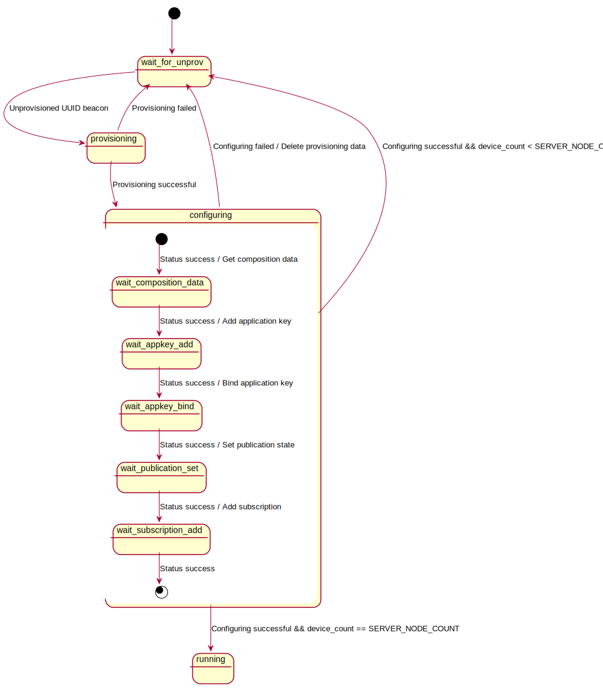
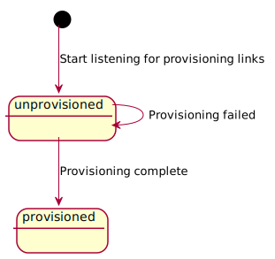

# Light switch Example

## Purpose

This demo project consists of one example which has combined server and client - The light switch server with  GATT
proxy support, the light switch client and a provisioner example.

It demonstrates the mesh eco system containing devices acting in two roles, a server role
a Node role. Provisioning has done by NRF mesh app, after provisioing one of the node will act as client and rest of the nodes will act as servers. 

## Getting started

### Hardware requirements

- two or more development(nrf52832) boards for the servers.

### Running the demo

## Running the example

To build the examples, follow the instructions in
[Building the Mesh Stack](@ref md_doc_getting_started_how_to_build). Refer to the *How to run examples*
section in [Examples README](@ref md_examples_README) for the commands required to program a
device using `nrfjprog`.

1. Erase the device flash of your development board, and program the SoftDevice.
2. Flash the provisioner and client firmware on individual boards and the server firmware on other boards.
3. After a reset, press Button 1 on the provisioner to start the provisioning and configuration of the
   devices. The provisioner first provisions and configures the client and then moves on to provision and configure the servers, one by one.
4. Use the [RTT](@ref segger-rtt) viewer to view the RTT output generated by the provisioner.

### Provisioning with nRF Mesh app

1. Switch off the provisioner board, and flash the client and server firmwares again.
2. Download the `nRF Mesh` app for your mobile phone (iOS or Android) and provision these nodes.
3. Bind the Generic OnOff client and server model instances on the nodes with the same app key.
4. Set the publish address of the 1st Generic OnOff client model instance on the client example to
the unicast address of any server node.
5. Press Button 1 on the client board to turn ON LED 1 on the corresponding server board.
6. Press Button 2 on the client board to turn OFF LED 1 on the corresponding server board.

## Details

### Mesh provisioner

The *provisoner* provisions and configures the nodes to setup a demo mesh network.
It is implemented as a multi-layered state machine due to the asynchronous nature of the provisioning and configuration process.

The provisioner first provisions and configures a client device with a known UUID.
After this it moves on to provision and configure the server devices.

The following diagram shows the typical state transitions of the provisioner while provisioning and configuring light switch servers.

For more information on how a provisioner works, see the [Mesh provisioning Guide](@ref md_doc_getting_started_provisioning).

### Light switch client

The *Light switch client* has a provisionee role in the network.
The client has four buttons to control the state of LED 1 on servers.
It instantiates two instances of Generic OnOff Client model.
The provisioner configures this client model instances to communicate with
servers.

### Light switch server

The *Light switch server* has a provisionee role in the network. It instantiates one instance
of the Generic OnOff server model to control the state of LED 1. The provisioner configures this
server model instance to communicate with the client model on the client board and to publish a message
when value of the OnOff state changes.

### GATT Proxy

Variants of both the Light switch server and Light switch client examples with additional
provisioning over GATT (PB-GATT) and Proxy Server support are provided as the *Light switch proxy
server* and *Light switch proxy client*, respectively. The proxy-enabled examples behave in the same
way as the non-proxy variant. Note that the *Proxy Client* role is **not** supported.

Read more about the Proxy feature in @ref md_doc_getting_started_gatt_proxy.

#### Light switch server (Proxy)

The Light switch proxy server example application has the same behavior as the light switch server, but
additionally has the proxy role enabled. As proxy is only supported on the nRF52, cmake will not
generate the proxy server example for nRF51.

The proxy server application can either be provisioned and configured by the provisioner device
like the light switch server, or by a GATT-based provisioner. After provisioning, the proxy server
application starts advertising a connectable proxy beacon, which can be connected to by a Proxy
Client to interact with the mesh. The Proxy Client acts like any other mesh device, but sends all
its mesh communication over a BLE connection to a Proxy Server, which relays it into the mesh.

#### Light switch client (Proxy)
The Light switch proxy client example has the same behavior as the light switch client, but
with the added Proxy Server support. The name might suggest that it also supports the Proxy Client,
however that is **not** the case.

### Generic OnOff client/server model

The Generic OnOff Client/Server is used for manipulating an
on/off state. Note that when the server has a publish address set (as in this example),
the server will publish any operation of its state change to its publish address.

More information about the Generic OnOff model can be found in the
[Generic OnOff model documentation](@ref GENERIC_ONOFF_MODEL)
and [Generic OnOff server behaviour documentation](@ref APP_ONOFF).

## Mesh SDK APIs

See the @subpage md_doc_getting_started_how_to_build_your_network
document to get a quick overview of the various SDK APIs.

